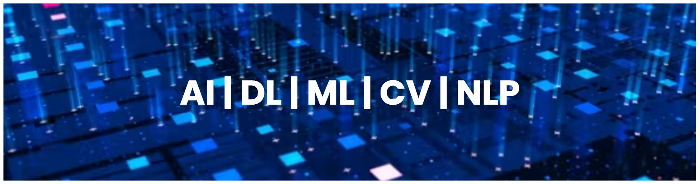

<!DOCTYPE html>
<html lang="en">
<head>
    <meta charset="UTF-8">
    <meta name="viewport" content="width=device-width, initial-scale=1.0">
    <title>Shreyansh Singh</title>
    
</head>
<body>
    

        <h1>Hi 👋, I'm Shreyansh Singh</h1>
        

            
        

        <h3>🚀 Computer Science undergrad passionate about tech and skilled problem solving. 2nd year at Chandigarh University. Proficient in Machine Learning, Deep Learning, Computer Vision, NLP, Data Science. Currently mastering Full Stack Web Dev (MERN stack) while enhancing other skills. Active IEEE CUSB and CSI member. Aspiring Software Developer. Let's connect!</h3>
        

            
        

        

            
        

        <h3>Connect with me:</h3>
        

            
            
            
        

        <h3>Languages and Tools:</h3>
        

            
            
            
            
            
            
            
            
            
            
            
            
            
            
            
            
        

    

</body>
</html>
